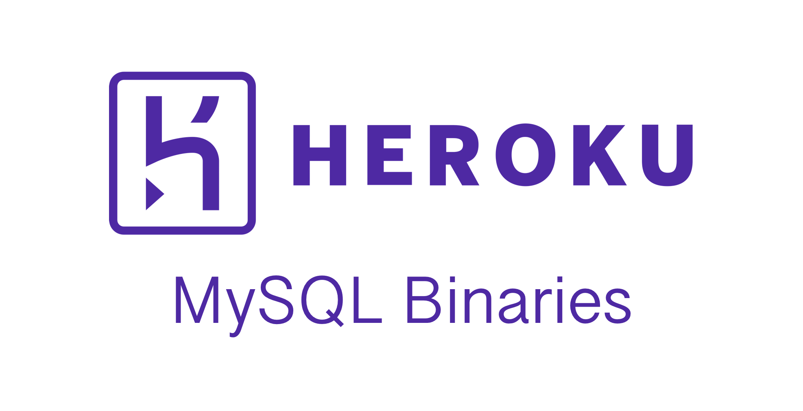
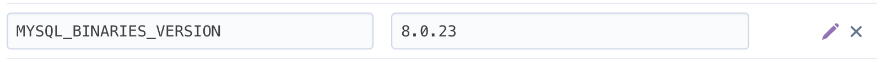

<p align="center"></p>

# Add MySQL binaries to your Heroku app

This Heroku buildpack adds MySQL binaries to your app. Useful if your application uses MySQL utilities like `mysqldump`.

## Installation

Add the URL of this repository to your app's buildpacks:

```bash
https://github.com/musa11971/heroku-buildpack-mysql-binaries
```

## Usage
The buildpack requires you to first declare which version of the MySQL binaries you would like to have installed. Do this by adding a new config (environment) variable named `MYSQL_BINARIES_VERSION`.  


The following versions are currently supported: 8.0.23, 5.7.33.  
If your desired version is not listed, don't worry. File a [GitHub issue](https://github.com/musa11971/heroku-buildpack-mysql-binaries/issues) and I will promptly add your version.  
  
The buildpack will automatically install the MySQL binaries and add them to the PATH.

## Contributing

Pull requests are welcomed.

### Security

If you discover any security related issues, please email mussesemou99@gmail.com instead of using the issue tracker.

## Credits

Credits go to [musa11971](https://github.com/musa11971) for creating and maintaining the buildpack.

Special thanks
- .. to [all contributors](../../contributors) for contributing to the project.

## Support me

I am a full-time software engineering student and work on this buildpack in my free time. If you find the buildpack useful, please consider making a [donation](https://www.paypal.me/musa11971)! Every little bit helps. 💜

## License

The MIT License (MIT). Please see [License File](LICENSE.md) for more information.
